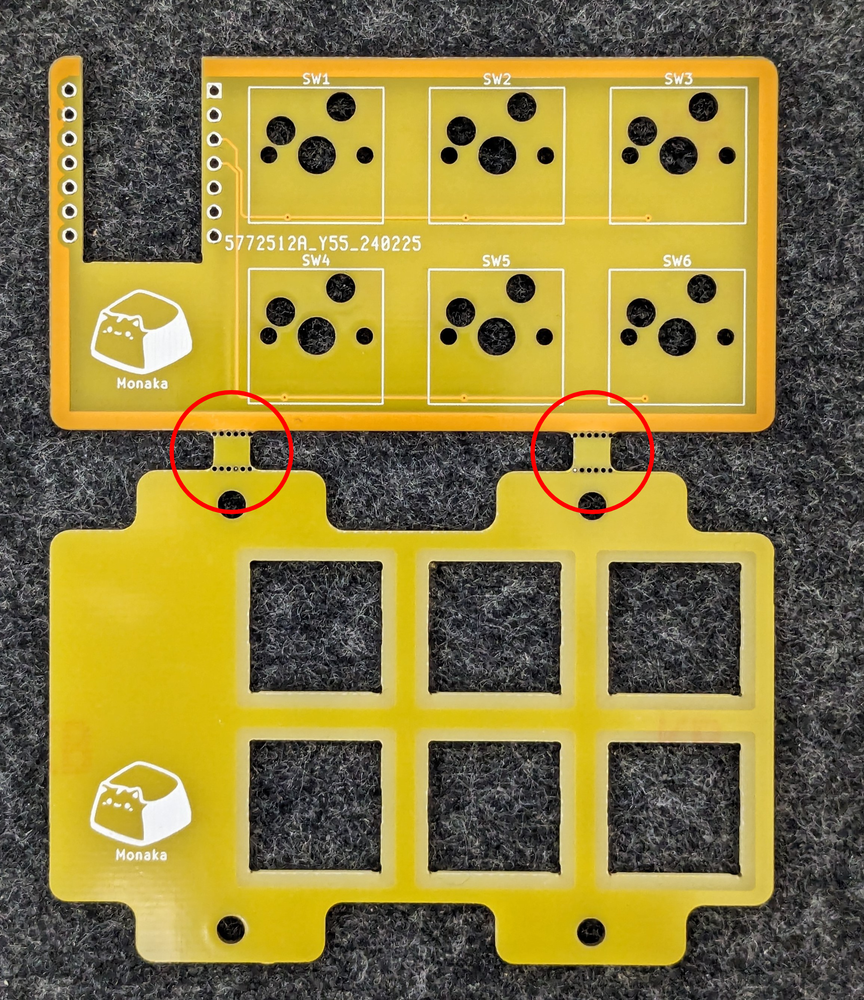
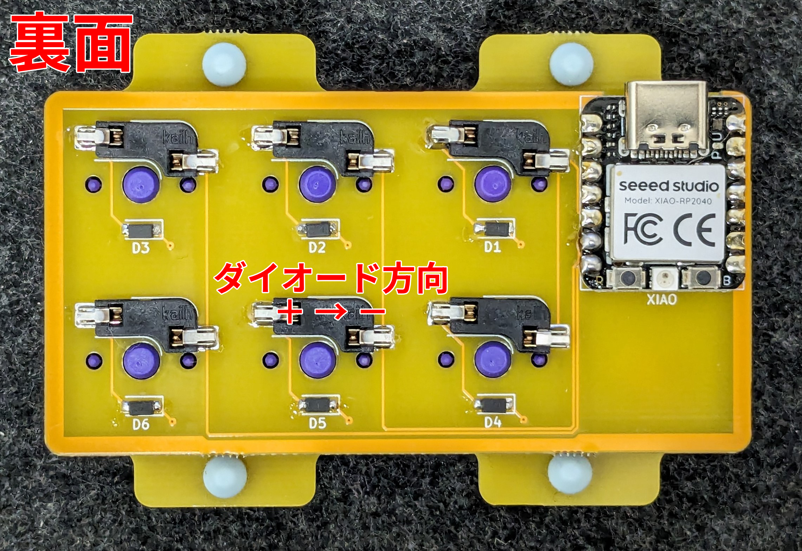

# MonakaPad ビルドガイド

## 1. はじめに

本書は自作キーボードであるMonakaPadのビルドガイドです。キーボードとして利用可能になるまでの手順を初心者向けに丁寧に記載したつもりですが、不明な個所などある場合は適時検索するなどして補ってください。

申し訳ないのですがMonakaPad固有でない一般のご質問にはお答えできません。各自お調べください。

## 2. 準備

### 2.1 内容物確認

> [!NOTE]
> 本キーボードキットは非売品です。ここでは天キー Vol.6にて配布したときの内容物を記載しています。不足している場合は個別に調達ください。

MonakaPadは本体となる基板とキースイッチ固定用のトッププレートのセットです。キーボードとして使用するにはその他必要な部品を別途調達し、ご自分でケースを3Dプリントいただく必要があります。

|品目|数量|
|---|---|
|MonakaPad 基板+トッププレート|1|
|ネオジム磁石 (ケース固定用)|8|
|Tadpole Pin (マウント用)|4|

### 2.2 別途用意が必要な部品

下記部品は国内外の自作キーボード専門店や電子部品販売店などから別途調達してください。

|品目|数量|備考|
|---|---|---|
|Seeed Studio XIAO RP2040|1|[Seeed Studio XIAO RP2040](https://www.seeedstudio.com/XIAO-RP2040-v1-0-p-5026.html)純正品をお勧めします。互換品もありますが動作するかはわかりません|
|1N4148W ダイオード (SOD123)|6|[Diodes Incorporated社製1N4148W](https://www.diodes.com/part/view/1N4148W)もしくはその互換品|
|MX互換キースイッチ|6|[Cherry MX](https://www.cherrymx.de/en/dev.html)もしくはその互換品|
|MX互換スイッチソケット|6|[Kailh PCB Socket CPG151101S11](https://www.kailhswitch.com/mechanical-keyboard-switches/box-switches/mechanical-keyboard-switches-kailh-pcb-socket.html)もしくはその互換品|
|MX互換キーキャップ|-|[Cherry MX](https://www.cherrymx.de/en/dev.html)もしくはその互換品|

### 2.3 専用ケース

下記ボトムケース、トップケースの両方を3Dプリントしてください。

- ボトムケース https://github.com/ymkn/MonakaPad/releases/download/v1.0/MonakaPad_Case.step
- トップケース https://github.com/ymkn/MonakaPad/releases/download/v1.0/MonakaPad_TopCase.step

## 3. ファームウェアの書き込み

まず初めにXIAO RP2040の動作確認と、ファームウェアの書き込みを行います。

## 3.1 PRK Firmwareのダウンロード

PRK Firmwareの配布サイトからUF2ファイルを入手してください。ZIP等で圧縮されている場合は展開してください。

https://github.com/picoruby/prk_firmware/releases

> [!NOTE]
> 本ビルドガイドを執筆しているときの最新版と思われる `prk_firmware-MSC_FLASH-0.9.23-20231119-0c8a999.uf2.zip` での動作を確認済みです。

## 3.2 XIAO RP2040の動作確認とファームウェアの書き込み

お使いのコンピュータのUSB 2.0以上に対応したUSBコネクタと、XIAO RP2040を接続してください。XIAO RP2040が正常であれば、`RPI-RP2`というドライブがマウントされると思います。

もしマウントされない場合は、USBケーブルを接続した状態のままXIAO RP2040のBOOTボタンを押しながらRESETボタンを押してください。これで`RPI-RP2`というドライブがマウントされれば問題ありません。もしこれでも何も起きない場合、XIAO RP2040が壊れている可能性があります。。。

この`RPI-RP2`というドライブに、先ほどダウンロードしたファームウェアをコピーしてください。しばらくすると`RPI-RP2`ドライブがアンマウントされ、代わりに`PRK DRIVE`ドライブがマウントされます。これで書き込み成功です。

何らかの理由でやり直したい場合は、XIAO RP2040のBOOTボタンを押しながらRESETボタンを押すことで、再び`RPI-RP2`というドライブをマウントすることができます。

## 3.3 PRK Firmware用のconfigをダウンロードし書き込み

下記からconfig.rbをダウンロードし、`PRK DRIVE`の中のconfig.rbへ上書きコピーしてください。

https://github.com/ymkn/MonakaPad/blob/main/firmware/PRK/config.rb

コピーが成功しても何も起きませんが、これで成功となります。XIAO RP2040からUSBケーブルを抜いてください。

## 4. 組み立て

### 4.1 基板とスイッチプレートの分離

MonakaPadは基板とスイッチプレートが一体の状態です。写真赤丸部分に切り取り穴が空いていますので、基板を折り曲げるようにして切り離してください。

> [!CAUTION]
> 基板やスイッチプレートを割らないように注意してください。真ん中の小さい部分だけが残ってしまったときは、ペンチ等で折り曲げると切り離しやすいです。

### 4.2 はんだ付け

#### 4.2.1 ダイオードのはんだ付け

ダイオードは基板の裏面に取り付けます。コの字状のガイドが白線でキー数分印刷されていますので、そのすべてにダイオードをはんだ付けします。

ダイオードは向きが決まっています。ダイオード上の目印が印刷されている側（カソード側）が向かって右側になるようにしてください。

まず片足だけをはんだ付けした状態でテスターを使い導通確認をすると安心です。

すべてのダイオードが基板に密着しており、両端とも漏れなくはんだ付けされているか確認してください。基板から浮いていたり、はんだ付けができていないとキースイッチの動作不良の原因になります。

#### 4.2.2 スイッチソケットのはんだ付け

スイッチソケットもダイオードと同様に基板の裏面に取り付けます。L字状のガイドが白線でキー数分印刷されていますので、そのすべてにスイッチソケットをはんだ付けします。

すべてのスイッチソケットが基板に密着しており、ソケット両端とも漏れなくはんだ付けされているか確認してください。基板から浮いていたり、はんだ付けができていないとキースイッチの動作不良の原因になります。

#### 4.2.3 XIAO RP2040のはんだ付け

XIAO RP2040も同様に基板の裏面に取り付けます。基板右上の切り欠きとパッドに位置を合わせてはんだ付けをしてください。

> [!CAUTION]
> XIAO RP2040の向きを間違えないようにしてください。写真の通り、裏面から見た時に、ボタンが見えるような向きである必要があります。表裏を間違えると動作しませんのでご注意ください。

### 4.3 スイッチとトッププレートの取り付け

キースイッチはトッププレートを通して基板のソケットに差し込みます。

### 4.4 キーキャップの取り付け

全てのスイッチにキーキャップを取り付けたら基板部分は完成です！

### 4.5 ケース固定用磁石の取り付け

MonakaPadのケースは磁力で固定します。ボトムケース、トップケースの短辺に磁石を貼り付ける薄い大きめの穴が空いていますので、ボトムケースとトップケースが引き合うように磁石の向きに気をつけて接着剤等で貼り付けてください。

## 5. 使用

### 5.1 動作確認

コンピュータにMonakaPadを接続し、文字が入力できることを確認してください。

### 5.2 キーマップのカスタマイズ

キーマップはPRK DRIVE内の`config.rb`を修正することで変更可能です。

`config.rb`をテキストエディタで開き、下記箇所の`KC_?`をお好みのキーコードに変更してください。

~~~
kbd.add_layer :default, %i(
  KC_1    KC_2    KC_3
  KC_4    KC_5    KC_6
)
~~~

キーコードの一覧： https://github.com/picoruby/prk_firmware/wiki/Keycodes_ja

## 6. その他

### 6.1 ブートモードの入り方

XIAO RP2040のBOOTボタンを押しながらRESETボタンを押します。

### 6.2 ソースコード/設計データのありか

本リポジトリ内で公開しています。MITライセンスです。

https://github.com/ymkn/MonakaPad
